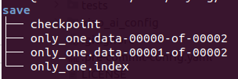
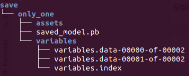

## tensorflow save and load model

### 1. 只保存模型权重

```python
model.save_weights(path)
model.load_weights(path)
```

或者通过回调函数

```python
cp_callback = tf.keras.callbacks.ModelCheckpoint(filepath=checkpoint_path,
                                                 save_weights_only=True,
                                                 verbose=1)

model.fit(train_images, 
          train_labels,  
          epochs=10,
          validation_data=(test_images,test_labels),
          callbacks=[cp_callback])
```

以`mode.save_weights('save/only_one')`为例，保存的文件由三个组成部分组成：



- checkpoint:可以打开看，内容为

```
model_checkpoint_path: "only_one"
all_model_checkpoint_paths: "only_one"
```

- 一个或者多个包含模型权重的分片
- 索引文件，指示哪些权重存储在哪个分片中

### 2. 保存整个模型

两种格式，SaveModel格式和HDF5格式，前者和Tensorflow Serving兼容，感觉更推荐。

```python
model.save('save/only_one')
```

保存的结果也是三个部分，这里创建了一个文件夹



- 第一个是assets，空的；
- 第二个是pb文件(**protobuf二进制文件**)，保存了整个静态图，所以，不再需要py文件了；
- 第三个是variables，这个应该是权重了；

在加载的时候，**需要指定目录，并且该目录下需要有一个名为saved_model.pb的文件**。